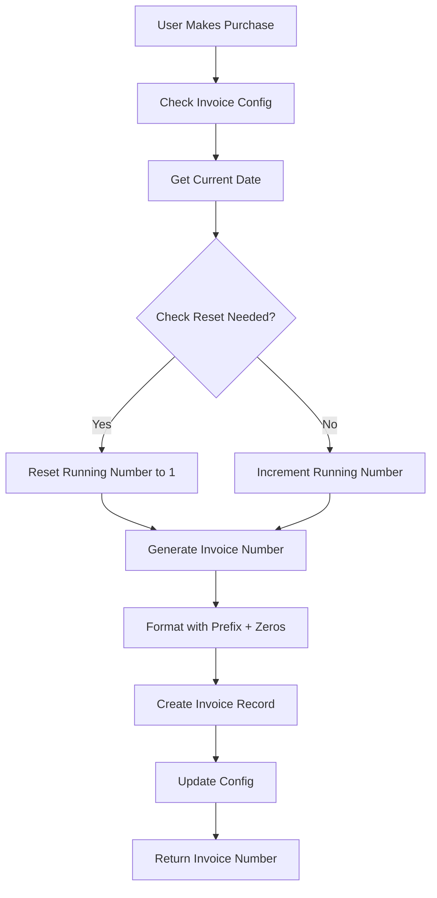

# Invoice Numbering System

## Overview

This document describes the invoice numbering system for the StartupKit platform. The system automatically generates unique, sequential invoice numbers when users make purchases or subscribe to services.

## Invoice Number Components

### Core Fields

| Field | Type | Description | Example |
|-------|------|-------------|---------|
| `invoiceNo` | string | Complete generated invoice number | `INV-250001` |
| `invoicePrefix` | string | Custom prefix for invoice numbers | `INV-` |
| `invoiceRunningNo` | number | Current sequential number | `1` |
| `invoiceCurrentNo` | number | Last used invoice number | `250001` |
| `invoiceNoType` | enum | Format type for invoice numbers | `year_running` |
| `invoiceLeadingZeros` | number | Number of leading zeros (1-10) | `4` |

## Invoice Number Types

### 1. Year + Running Number (`year_running`)

**Format:** `YY` + `RunningNo`

**Example:**
- Year: 2025
- Running No: 1
- Leading Zeros: 4
- Result: `250001`

**Use Case:** Simple year-based tracking, resets annually

---

### 2. Year + Month + Running Number (`year_month_running`)

**Format:** `YY` + `MM` + `RunningNo`

**Example:**
- Year: 2025
- Month: 12 (December)
- Running No: 1
- Leading Zeros: 4
- Result: `25120001`

**Use Case:** Monthly tracking, resets each month

---

### 3. Year + Month (EN) + Running Number (`year_month_en_running`)

**Format:** `YY` + `MonthCode` + `RunningNo`

**Month Codes:**
- JA (January)
- FE (February)
- MR (March)
- AP (April)
- MY (May)
- JN (June)
- JL (July)
- AU (August)
- SE (September)
- OC (October)
- NO (November)
- DE (December)

**Example:**
- Year: 2025
- Month: January
- Running No: 1
- Leading Zeros: 4
- Result: `25JA0001`

**Use Case:** Human-readable month identification

---

## Complete Invoice Number Format

```
[Prefix][YearMonthCode][RunningNumber]
```

### Examples with Prefix

| Type | Prefix | Year | Month | Running | Zeros | Result |
|------|--------|------|-------|---------|-------|--------|
| year_running | INV- | 2025 | - | 1 | 4 | `INV-250001` |
| year_month_running | INV- | 2025 | 12 | 1 | 4 | `INV-25120001` |
| year_month_en_running | INV- | 2025 | 01 | 1 | 4 | `INV-25JA0001` |
| year_running | | 2025 | - | 123 | 6 | `250000123` |
| year_month_running | SALE- | 2025 | 03 | 45 | 3 | `SALE-250345` |

---

## Reset Logic

### Year + Running Number
- Resets: January 1st of each year
- Running number starts from 1

### Year + Month + Running Number
- Resets: 1st day of each month
- Running number starts from 1

### Year + Month (EN) + Running Number
- Resets: 1st day of each month
- Running number starts from 1

---

## Database Schema

### `invoice_config` Table

Stores the invoice numbering configuration (single record).

```typescript
{
  _id: Id<"invoice_config">,
  invoicePrefix: string,           // e.g., "INV-"
  invoiceNoType: string,            // "year_running" | "year_month_running" | "year_month_en_running"
  invoiceLeadingZeros: number,      // 1-10
  invoiceRunningNo: number,         // Current running number
  invoiceCurrentNo: string,         // Last generated invoice number
  lastResetDate: number,            // Timestamp of last reset
  createdAt: number,
  updatedAt: number,
}
```

### `invoices` Table

Stores individual invoice records.

```typescript
{
  _id: Id<"invoices">,
  invoiceNo: string,                // Generated invoice number
  userId: Id<"users">,              // User who made the purchase
  amount: number,                   // Invoice amount
  currency: string,                 // e.g., "USD"
  status: string,                   // "draft" | "issued" | "paid" | "cancelled"
  items: Array<{
    description: string,
    quantity: number,
    unitPrice: number,
    total: number,
  }>,
  billingDetails: {
    name: string,
    email: string,
    address?: string,
    city?: string,
    country?: string,
    postalCode?: string,
  },
  issuedAt: number,                 // Timestamp when issued
  dueDate?: number,                 // Payment due date
  paidAt?: number,                  // Timestamp when paid
  createdAt: number,
  updatedAt: number,
}
```

---

## Invoice Generation Flow



---

## API Functions

### Configuration

#### `getInvoiceConfig()`
Returns current invoice configuration.

#### `updateInvoiceConfig({ prefix, type, leadingZeros })`
Updates invoice numbering settings.

#### `resetInvoiceCounter()`
Manually resets the running number to 1.

---

### Invoice Generation

#### `generateInvoiceNumber()`
Generates the next invoice number based on configuration.

**Returns:**
```typescript
{
  invoiceNo: string,      // e.g., "INV-250001"
  runningNo: number,      // e.g., 1
}
```

#### `createInvoice({ userId, amount, items, billingDetails })`
Creates a new invoice with auto-generated invoice number.

**Returns:**
```typescript
{
  _id: Id<"invoices">,
  invoiceNo: string,
  // ... other invoice fields
}
```

---

## Email Integration

### Invoice Number Variable

All email templates support the `{invoiceNo}` variable:

```html
<p>Invoice Number: {invoiceNo}</p>
<p>Thank you for your purchase!</p>
```

### Payment Notification Email

```html
<!DOCTYPE html>
<html>
<body>
  <h1>Payment Received</h1>
  <p>Dear {user_name},</p>
  <p>We have received your payment for invoice <strong>{invoiceNo}</strong>.</p>
  <p>Amount: ${payment_amount}</p>
  <p>Date: {payment_date}</p>
</body>
</html>
```

### Subscription Email

```html
<!DOCTYPE html>
<html>
<body>
  <h1>Subscription Confirmation</h1>
  <p>Dear {user_name},</p>
  <p>Your subscription has been activated.</p>
  <p>Invoice Number: <strong>{invoiceNo}</strong></p>
  <p>Plan: {subscription_plan}</p>
  <p>Next billing date: {next_billing_date}</p>
</body>
</html>
```

---

## Configuration Examples

### Example 1: Simple Year-Based

```typescript
{
  invoicePrefix: "INV-",
  invoiceNoType: "year_running",
  invoiceLeadingZeros: 4,
  invoiceRunningNo: 1,
}
// Generates: INV-250001, INV-250002, INV-250003...
```

### Example 2: Monthly Tracking

```typescript
{
  invoicePrefix: "SALE-",
  invoiceNoType: "year_month_running",
  invoiceLeadingZeros: 5,
  invoiceRunningNo: 1,
}
// January: SALE-2501000001, SALE-2501000002...
// February: SALE-2502000001, SALE-2502000002...
```

### Example 3: Human-Readable Month

```typescript
{
  invoicePrefix: "",
  invoiceNoType: "year_month_en_running",
  invoiceLeadingZeros: 4,
  invoiceRunningNo: 1,
}
// January: 25JA0001, 25JA0002...
// February: 25FE0001, 25FE0002...
```

---

## Best Practices

### 1. Leading Zeros
- **Recommended:** 4-6 digits
- **Minimum:** 3 digits (allows up to 999 invoices)
- **Maximum:** 10 digits

### 2. Prefix Selection
- Keep it short (2-5 characters)
- Use uppercase for consistency
- Include separator if needed (e.g., `INV-`, `SALE_`)

### 3. Type Selection
- **year_running:** Best for businesses with < 10,000 invoices/year
- **year_month_running:** Best for high-volume monthly tracking
- **year_month_en_running:** Best for human readability

### 4. Reset Strategy
- Automatic resets prevent number overflow
- Manual reset available for special cases
- Always backup before manual reset

---

## Migration & Initialization

### First-Time Setup

```typescript
// Default configuration
{
  invoicePrefix: "INV-",
  invoiceNoType: "year_running",
  invoiceLeadingZeros: 4,
  invoiceRunningNo: 1,
  invoiceCurrentNo: "",
  lastResetDate: Date.now(),
}
```

### Changing Invoice Format

⚠️ **Warning:** Changing the invoice number type mid-year may cause confusion.

**Recommended Approach:**
1. Wait until natural reset period (new year/month)
2. Update configuration
3. Document the change
4. Notify accounting team

---

## Testing Scenarios

### Test Case 1: Year Rollover
```
Date: Dec 31, 2024 → Jan 1, 2025
Type: year_running
Before: 240999
After: 250001 (resets)
```

### Test Case 2: Month Rollover
```
Date: Jan 31, 2025 → Feb 1, 2025
Type: year_month_running
Before: 25010050
After: 25020001 (resets)
```

### Test Case 3: High Volume
```
Type: year_month_running
Leading Zeros: 6
Invoice 1: 250100000001
Invoice 999999: 250100999999
Invoice 1000000: Error (exceeds capacity)
```

---

## Error Handling

### Overflow Detection
- System checks if running number exceeds leading zeros capacity
- Throws error if overflow detected
- Suggests increasing leading zeros or changing type

### Duplicate Prevention
- Transaction-based number generation
- Atomic increment operations
- Retry logic for race conditions

### Reset Validation
- Confirms reset is intentional
- Logs all reset operations
- Maintains audit trail

---

## Admin UI Requirements

### Configuration Panel
- [ ] Invoice prefix input
- [ ] Invoice type dropdown
- [ ] Leading zeros slider (1-10)
- [ ] Current running number display
- [ ] Last invoice number display
- [ ] Reset button with confirmation
- [ ] Preview of next invoice number

### Invoice List
- [ ] Search by invoice number
- [ ] Filter by status
- [ ] Date range filter
- [ ] Export to CSV/PDF
- [ ] Bulk operations

---

## Future Enhancements

1. **Custom Formats:** Allow regex-based custom formats
2. **Multi-Currency:** Different prefixes per currency
3. **Branch Support:** Different sequences per branch/location
4. **Fiscal Year:** Support for non-calendar fiscal years
5. **Credit Notes:** Separate numbering for credit notes
6. **Proforma Invoices:** Draft invoice numbering

---

## Compliance & Standards

### Tax Requirements
- Ensure sequential numbering (no gaps)
- Maintain audit trail
- Store for required retention period (typically 7 years)

### International Standards
- ISO 8601 for dates
- ISO 4217 for currency codes
- Locale-specific formatting

---

## Support & Troubleshooting

### Common Issues

**Issue:** Invoice numbers have gaps
- **Cause:** Failed transactions
- **Solution:** Normal behavior, gaps are acceptable

**Issue:** Duplicate invoice numbers
- **Cause:** Race condition
- **Solution:** System automatically retries with next number

**Issue:** Wrong format after reset
- **Cause:** Configuration changed mid-period
- **Solution:** Wait for natural reset or manually reset

---

## Changelog

### Version 1.0.0 (2025-01-12)
- Initial invoice numbering system design
- Support for 3 invoice number types
- Configurable prefix and leading zeros
- Automatic reset logic
- Email template integration
