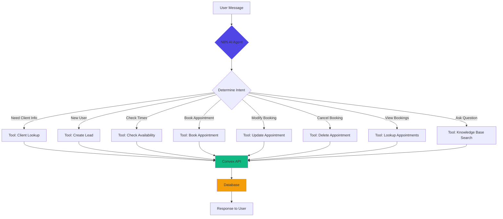

# N8N AI Chatbot Implementation Guide

**Last Updated:** Jan 26, 2026  
**Status:** Complete Implementation Guide  
**Architecture:** AI Agent with Tool Calling

---

## 📋 Overview

Complete implementation guide for building an intelligent N8N chatbot that integrates with your Convex backend. The chatbot uses AI Agent architecture with tool calling to handle:

- **Client Management** - Lookup existing clients, create new leads
- **Booking Operations** - Check availability, book/update/delete appointments
- **Knowledge Base** - Answer questions from your documentation
- **Authentication** - Handle both logged-in and anonymous users

---

## 🎯 System Capabilities Analysis

### ✅ **What Your System Already Supports**

1. **Knowledge Base System** ✅
   - Table: `knowledge_base`
   - Search by keywords, tags, categories
   - Support for markdown content
   - Published/draft status
   - File: `convex/knowledgeBase.ts`

2. **Client Management** ✅
   - Table: `clients`
   - Create, lookup, update clients
   - Search by email, phone, name
   - File: `convex/bookingMutations.ts`, `convex/bookingQueries.ts`

3. **Booking Endpoints** ✅
   - Check availability
   - Create appointment
   - Update appointment
   - Delete appointment
   - Lookup appointments
   - File: `convex/bookingTools.ts`

4. **HTTP Actions** ✅
   - All endpoints exposed via HTTP
   - Ready for N8N integration
   - JSON request/response

### ❌ **What Needs to Be Added**

1. **Lead/CRM System** - Need to create for non-authenticated users
2. **Knowledge Base HTTP Endpoint** - Need to expose for N8N
3. **Client Lookup HTTP Endpoint** - Need to expose for N8N
4. **Session Management** - Track chatbot conversations

---

## 🏗️ Architecture Overview



---

## 🛠️ Implementation Steps

### **Step 1: Create Missing Convex Endpoints**

We need to add HTTP endpoints for:
1. Client lookup
2. Lead creation (CRM)
3. Knowledge base search

#### 1.1 Add Lead/CRM System

Create `convex/leads.ts`:

```typescript
import { v } from "convex/values";
import { mutation, query } from "./_generated/server";

// Lead schema - for non-authenticated users
export const createLead = mutation({
  args: {
    name: v.string(),
    email: v.string(),
    phone: v.optional(v.string()),
    source: v.optional(v.string()), // "chatbot", "website", etc.
    message: v.optional(v.string()),
    status: v.optional(v.string()), // "new", "contacted", "converted"
  },
  handler: async (ctx, args) => {
    const leadId = await ctx.db.insert("leads", {
      name: args.name,
      email: args.email,
      phone: args.phone,
      source: args.source || "chatbot",
      message: args.message,
      status: args.status || "new",
      createdAt: Date.now(),
      updatedAt: Date.now(),
    });
    return leadId;
  },
});

export const getLeadByEmail = query({
  args: { email: v.string() },
  handler: async (ctx, { email }) => {
    return await ctx.db
      .query("leads")
      .withIndex("by_email", (q) => q.eq("email", email))
      .first();
  },
});

export const convertLeadToClient = mutation({
  args: {
    leadId: v.id("leads"),
  },
  handler: async (ctx, { leadId }) => {
    const lead = await ctx.db.get(leadId);
    if (!lead) throw new Error("Lead not found");
    
    // Create client from lead
    const clientId = await ctx.db.insert("clients", {
      name: lead.name,
      email: lead.email,
      phone: lead.phone,
      notes: lead.message,
      tags: ["converted-from-lead"],
      totalAppointments: 0,
      completedAppointments: 0,
      cancelledAppointments: 0,
      noShowCount: 0,
      createdAt: Date.now(),
      updatedAt: Date.now(),
      firstBookedAt: Date.now(),
    });
    
    // Update lead status
    await ctx.db.patch(leadId, {
      status: "converted",
      convertedToClientId: clientId,
      updatedAt: Date.now(),
    });
    
    return clientId;
  },
});
```

#### 1.2 Add Schema for Leads

Add to `convex/schema.ts`:

```typescript
// Add inside defineSchema({...})
leads: defineTable({
  name: v.string(),
  email: v.string(),
  phone: v.optional(v.string()),
  source: v.string(), // "chatbot", "website", "referral"
  message: v.optional(v.string()),
  status: v.string(), // "new", "contacted", "converted", "lost"
  convertedToClientId: v.optional(v.id("clients")),
  createdAt: v.number(),
  updatedAt: v.number(),
})
  .index("by_email", ["email"])
  .index("by_status", ["status"])
  .index("by_createdAt", ["createdAt"]),
```

#### 1.3 Add HTTP Endpoints for N8N Tools

Add to `convex/bookingTools.ts`:

```typescript
// ============================================
// TOOL 5: Client Lookup
// ============================================
export const lookupClient = httpAction(async (ctx, request) => {
  const { email, phone } = await request.json();
  
  let client = null;
  
  if (email) {
    client = await ctx.runQuery(api.bookingQueries.getClientByEmail, { email });
  } else if (phone) {
    client = await ctx.runQuery(api.bookingQueries.getClientByPhone, { phone });
  }
  
  return new Response(JSON.stringify({
    success: true,
    client: client || null,
    exists: !!client,
  }), {
    headers: { "Content-Type": "application/json" },
  });
});

// ============================================
// TOOL 6: Create Lead (for new users)
// ============================================
export const createLead = httpAction(async (ctx, request) => {
  const { name, email, phone, message } = await request.json();
  
  // Check if lead already exists
  const existingLead = await ctx.runQuery(api.leads.getLeadByEmail, { email });
  
  if (existingLead) {
    return new Response(JSON.stringify({
      success: true,
      leadId: existingLead._id,
      message: "Lead already exists",
      isNew: false,
    }), {
      headers: { "Content-Type": "application/json" },
    });
  }
  
  // Create new lead
  const leadId = await ctx.runMutation(api.leads.createLead, {
    name,
    email,
    phone,
    message,
    source: "chatbot",
  });
  
  return new Response(JSON.stringify({
    success: true,
    leadId,
    message: "Lead created successfully",
    isNew: true,
  }), {
    headers: { "Content-Type": "application/json" },
  });
});

// ============================================
// TOOL 7: Knowledge Base Search
// ============================================
export const searchKnowledgeBase = httpAction(async (ctx, request) => {
  const { query, type = "frontend" } = await request.json();
  
  const articles = await ctx.runQuery(api.knowledgeBase.searchArticles, {
    type,
    query,
  });
  
  // Return top 3 most relevant articles
  const topArticles = articles.slice(0, 3).map(article => ({
    title: article.title,
    content: article.content,
    category: article.category,
    tags: article.tags,
  }));
  
  return new Response(JSON.stringify({
    success: true,
    results: topArticles,
    count: topArticles.length,
  }), {
    headers: { "Content-Type": "application/json" },
  });
});

// ============================================
// TOOL 8: Lookup Appointments
// ============================================
export const lookupAppointments = httpAction(async (ctx, request) => {
  const { clientEmail } = await request.json();
  
  // Find client
  const client = await ctx.runQuery(api.bookingQueries.getClientByEmail, { 
    email: clientEmail 
  });
  
  if (!client) {
    return new Response(JSON.stringify({
      success: false,
      message: "Client not found",
      appointments: [],
    }), {
      headers: { "Content-Type": "application/json" },
    });
  }
  
  // Get appointments
  const appointments = await ctx.runQuery(api.bookingQueries.getAppointmentsByClient, {
    clientId: client._id,
    limit: 10,
  });
  
  return new Response(JSON.stringify({
    success: true,
    appointments: appointments.map(apt => ({
      id: apt._id,
      date: apt.date,
      startTime: apt.startTime,
      endTime: apt.endTime,
      duration: apt.duration,
      status: apt.status,
      type: apt.appointmentType,
      notes: apt.notes,
    })),
  }), {
    headers: { "Content-Type": "application/json" },
  });
});
```

#### 1.4 Register HTTP Routes

Add to `convex/http.ts`:

```typescript
import { lookupClient, createLead, searchKnowledgeBase, lookupAppointments } from "./bookingTools";

// Add these routes
http.route({
  path: "/api/booking/lookup-client",
  method: "POST",
  handler: lookupClient,
});

http.route({
  path: "/api/booking/create-lead",
  method: "POST",
  handler: createLead,
});

http.route({
  path: "/api/booking/search-knowledge",
  method: "POST",
  handler: searchKnowledgeBase,
});

http.route({
  path: "/api/booking/lookup-appointments",
  method: "POST",
  handler: lookupAppointments,
});
```

---

### **Step 2: Create N8N AI Agent Workflow**

#### 2.1 Workflow Structure

```
1. Chat Trigger (Webhook or Chat Widget)
   ↓
2. AI Agent Node (OpenAI/Anthropic)
   ↓
3. Tools (8 total):
   - Client Lookup
   - Create Lead
   - Check Availability
   - Book Appointment
   - Update Appointment
   - Delete Appointment
   - Lookup Appointments
   - Knowledge Base Search
   ↓
4. Response to User
```

#### 2.2 AI Agent Configuration

**System Prompt:**

```
You are a helpful booking assistant for [Your Company Name]. Your role is to help users:
1. Check appointment availability
2. Book new appointments
3. Modify or cancel existing appointments
4. Answer questions about our services

IMPORTANT RULES:
- Always check if the user is an existing client first using their email
- For new users, create a lead so we can contact them
- Be friendly, professional, and concise
- Confirm all booking details before finalizing
- Provide clear next steps

When booking appointments:
1. Get client name and email
2. Check if they exist (use Client Lookup tool)
3. If new user, create lead (use Create Lead tool)
4. Ask for preferred date
5. Show available times (use Check Availability tool)
6. Confirm and book (use Book Appointment tool)

For questions about services, hours, or policies:
- Use Knowledge Base Search tool first
- Provide accurate information from the knowledge base
- If not found, politely say you'll have someone contact them
```

#### 2.3 Tool Definitions for N8N

**Tool 1: Client Lookup**
```json
{
  "name": "client_lookup",
  "description": "Look up an existing client by email or phone to check if they have an account",
  "parameters": {
    "type": "object",
    "properties": {
      "email": {
        "type": "string",
        "description": "Client's email address"
      },
      "phone": {
        "type": "string",
        "description": "Client's phone number (optional)"
      }
    },
    "required": ["email"]
  },
  "endpoint": "https://your-domain.convex.site/api/booking/lookup-client",
  "method": "POST"
}
```

**Tool 2: Create Lead**
```json
{
  "name": "create_lead",
  "description": "Create a new lead for users who don't have an account yet. Use this for new users before they book their first appointment.",
  "parameters": {
    "type": "object",
    "properties": {
      "name": {
        "type": "string",
        "description": "Lead's full name"
      },
      "email": {
        "type": "string",
        "description": "Lead's email address"
      },
      "phone": {
        "type": "string",
        "description": "Lead's phone number (optional)"
      },
      "message": {
        "type": "string",
        "description": "Any message or notes from the lead"
      }
    },
    "required": ["name", "email"]
  },
  "endpoint": "https://your-domain.convex.site/api/booking/create-lead",
  "method": "POST"
}
```

**Tool 3: Check Availability**
```json
{
  "name": "check_availability",
  "description": "Check available appointment slots for a specific date",
  "parameters": {
    "type": "object",
    "properties": {
      "date": {
        "type": "string",
        "description": "Date in YYYY-MM-DD format (e.g., 2026-02-15)"
      },
      "duration": {
        "type": "number",
        "description": "Appointment duration in minutes (default: 60)"
      }
    },
    "required": ["date"]
  },
  "endpoint": "https://your-domain.convex.site/api/booking/check-availability",
  "method": "POST"
}
```

**Tool 4: Book Appointment**
```json
{
  "name": "book_appointment",
  "description": "Book a new appointment for a client",
  "parameters": {
    "type": "object",
    "properties": {
      "clientEmail": {
        "type": "string",
        "description": "Client's email address"
      },
      "clientName": {
        "type": "string",
        "description": "Client's full name"
      },
      "clientPhone": {
        "type": "string",
        "description": "Client's phone number (optional)"
      },
      "date": {
        "type": "string",
        "description": "Appointment date in YYYY-MM-DD format"
      },
      "startTime": {
        "type": "string",
        "description": "Start time in HH:MM format (e.g., 14:00)"
      },
      "duration": {
        "type": "number",
        "description": "Duration in minutes (default: 60)"
      },
      "appointmentType": {
        "type": "string",
        "description": "Type of appointment (e.g., consultation, follow-up)"
      },
      "notes": {
        "type": "string",
        "description": "Additional notes or requirements"
      }
    },
    "required": ["clientEmail", "clientName", "date", "startTime"]
  },
  "endpoint": "https://your-domain.convex.site/api/booking/create-appointment",
  "method": "POST"
}
```

**Tool 5: Update Appointment**
```json
{
  "name": "update_appointment",
  "description": "Update an existing appointment (reschedule or modify details)",
  "parameters": {
    "type": "object",
    "properties": {
      "appointmentId": {
        "type": "string",
        "description": "The appointment ID to update"
      },
      "date": {
        "type": "string",
        "description": "New date in YYYY-MM-DD format (optional)"
      },
      "startTime": {
        "type": "string",
        "description": "New start time in HH:MM format (optional)"
      },
      "notes": {
        "type": "string",
        "description": "Updated notes (optional)"
      }
    },
    "required": ["appointmentId"]
  },
  "endpoint": "https://your-domain.convex.site/api/booking/update-appointment",
  "method": "POST"
}
```

**Tool 6: Delete Appointment**
```json
{
  "name": "delete_appointment",
  "description": "Cancel/delete an appointment",
  "parameters": {
    "type": "object",
    "properties": {
      "appointmentId": {
        "type": "string",
        "description": "The appointment ID to cancel"
      },
      "reason": {
        "type": "string",
        "description": "Reason for cancellation (optional)"
      }
    },
    "required": ["appointmentId"]
  },
  "endpoint": "https://your-domain.convex.site/api/booking/delete-appointment",
  "method": "POST"
}
```

**Tool 7: Lookup Appointments**
```json
{
  "name": "lookup_appointments",
  "description": "Find all appointments for a client by their email",
  "parameters": {
    "type": "object",
    "properties": {
      "clientEmail": {
        "type": "string",
        "description": "Client's email address"
      }
    },
    "required": ["clientEmail"]
  },
  "endpoint": "https://your-domain.convex.site/api/booking/lookup-appointments",
  "method": "POST"
}
```

**Tool 8: Knowledge Base Search**
```json
{
  "name": "search_knowledge_base",
  "description": "Search the knowledge base for answers to questions about services, policies, hours, etc.",
  "parameters": {
    "type": "object",
    "properties": {
      "query": {
        "type": "string",
        "description": "The question or search term"
      },
      "type": {
        "type": "string",
        "description": "Knowledge base type (default: frontend)",
        "enum": ["frontend", "user_panel"]
      }
    },
    "required": ["query"]
  },
  "endpoint": "https://your-domain.convex.site/api/booking/search-knowledge",
  "method": "POST"
}
```

---

### **Step 3: N8N Workflow JSON**

Create this workflow in N8N:

```json
{
  "name": "AI Booking Chatbot",
  "nodes": [
    {
      "parameters": {
        "path": "booking-chat",
        "responseMode": "responseNode",
        "options": {}
      },
      "name": "Webhook",
      "type": "n8n-nodes-base.webhook",
      "position": [250, 300]
    },
    {
      "parameters": {
        "model": "gpt-4-turbo-preview",
        "messages": {
          "values": [
            {
              "role": "system",
              "content": "You are a helpful booking assistant..."
            },
            {
              "role": "user",
              "content": "={{ $json.message }}"
            }
          ]
        },
        "tools": {
          "values": [
            {
              "name": "client_lookup",
              "description": "Look up existing client",
              "parameters": "..."
            }
            // ... all 8 tools
          ]
        }
      },
      "name": "AI Agent",
      "type": "@n8n/n8n-nodes-langchain.agent",
      "position": [450, 300]
    },
    {
      "parameters": {
        "respondWith": "={{ $json.output }}",
        "options": {}
      },
      "name": "Respond to Webhook",
      "type": "n8n-nodes-base.respondToWebhook",
      "position": [650, 300]
    }
  ],
  "connections": {
    "Webhook": {
      "main": [[{ "node": "AI Agent", "type": "main", "index": 0 }]]
    },
    "AI Agent": {
      "main": [[{ "node": "Respond to Webhook", "type": "main", "index": 0 }]]
    }
  }
}
```

---

## 🔄 Conversation Flow Examples

### Example 1: New User Booking

```
User: "Hi, I'd like to book an appointment"

Bot: "I'd be happy to help you book an appointment! May I have your name and email address?"

User: "John Doe, john@example.com"

Bot: [Uses Client Lookup tool]
     "Welcome John! I see you're new here. Let me create your profile."
     [Uses Create Lead tool]
     "What date would you like to book for?"

User: "Next Monday"

Bot: [Uses Check Availability tool]
     "I have the following times available on Monday, Feb 3rd:
     - 9:00 AM
     - 10:00 AM
     - 2:00 PM
     - 3:00 PM
     
     Which time works best for you?"

User: "2:00 PM please"

Bot: [Uses Book Appointment tool]
     "Perfect! I've booked your appointment for Monday, Feb 3rd at 2:00 PM.
     You'll receive a confirmation email at john@example.com shortly.
     Is there anything else I can help you with?"
```

### Example 2: Existing Client Rescheduling

```
User: "I need to reschedule my appointment"

Bot: "I can help with that! What's your email address?"

User: "jane@example.com"

Bot: [Uses Client Lookup tool]
     "Hi Jane! Let me look up your appointments."
     [Uses Lookup Appointments tool]
     "I see you have an appointment on Feb 5th at 10:00 AM.
     Would you like to reschedule this one?"

User: "Yes, can I move it to Feb 7th?"

Bot: [Uses Check Availability tool]
     "I have these times available on Feb 7th:
     - 9:00 AM
     - 11:00 AM
     - 1:00 PM
     
     Which would you prefer?"

User: "11:00 AM"

Bot: [Uses Update Appointment tool]
     "Done! Your appointment has been rescheduled to Feb 7th at 11:00 AM.
     You'll receive an updated confirmation email."
```

### Example 3: Knowledge Base Question

```
User: "What are your business hours?"

Bot: [Uses Knowledge Base Search tool with query: "business hours"]
     "Our business hours are:
     Monday-Friday: 9:00 AM - 5:00 PM
     Saturday: 10:00 AM - 2:00 PM
     Sunday: Closed
     
     Would you like to book an appointment during these hours?"
```

---

## 📝 Knowledge Base Setup

### Create Knowledge Base Articles

Add these articles to your `knowledge_base` table:

**Article 1: Business Hours**
```javascript
{
  type: "frontend",
  title: "Business Hours",
  content: "We are open Monday-Friday 9:00 AM - 5:00 PM, Saturday 10:00 AM - 2:00 PM. Closed on Sundays and major holidays.",
  category: "general",
  tags: ["hours", "schedule", "open"],
  keywords: ["hours", "open", "closed", "schedule", "time"],
  status: "published"
}
```

**Article 2: Cancellation Policy**
```javascript
{
  type: "frontend",
  title: "Cancellation Policy",
  content: "Appointments can be cancelled or rescheduled up to 24 hours in advance without penalty. Cancellations within 24 hours may incur a fee.",
  category: "policies",
  tags: ["cancellation", "policy", "reschedule"],
  keywords: ["cancel", "reschedule", "change", "policy"],
  status: "published"
}
```

**Article 3: Services Offered**
```javascript
{
  type: "frontend",
  title: "Our Services",
  content: "We offer: Initial Consultations (60 min), Follow-up Sessions (30 min), Group Sessions (90 min), and Virtual Appointments.",
  category: "services",
  tags: ["services", "appointments", "types"],
  keywords: ["services", "consultation", "session", "appointment types"],
  status: "published"
}
```

---

## 🚀 Deployment Checklist

### Backend (Convex)

- [ ] Add `leads` table to schema
- [ ] Deploy `convex/leads.ts`
- [ ] Add HTTP endpoints to `convex/bookingTools.ts`
- [ ] Register routes in `convex/http.ts`
- [ ] Deploy to Convex: `npx convex deploy`
- [ ] Test all endpoints with cURL/Postman
- [ ] Populate knowledge base with articles

### N8N Workflow

- [ ] Create new workflow in N8N
- [ ] Add Webhook trigger
- [ ] Configure AI Agent node
- [ ] Add all 8 tools with correct endpoints
- [ ] Update Convex URL in all tool endpoints
- [ ] Test system prompt
- [ ] Activate workflow
- [ ] Test with sample conversations

### Testing

- [ ] Test new user flow (lead creation)
- [ ] Test existing client flow (lookup)
- [ ] Test booking process
- [ ] Test rescheduling
- [ ] Test cancellation
- [ ] Test knowledge base queries
- [ ] Test error handling
- [ ] Test edge cases

---

## 🎯 Advanced Features

### Session Management

Track conversation context:

```typescript
// Add to bookingTools.ts
export const saveConversation = httpAction(async (ctx, request) => {
  const { sessionId, clientEmail, messages, status } = await request.json();
  
  const conversationId = await ctx.runMutation(api.bookingMutations.saveConversation, {
    sessionId,
    clientEmail,
    messages,
    status,
  });
  
  return new Response(JSON.stringify({ success: true, conversationId }), {
    headers: { "Content-Type": "application/json" },
  });
});
```

### Authentication Integration

For logged-in users, pass user context:

```typescript
// In N8N, add user context to AI Agent
{
  "userContext": {
    "isAuthenticated": true,
    "email": "user@example.com",
    "userId": "user_123"
  }
}
```

Update system prompt:
```
If user is authenticated (userContext.isAuthenticated = true):
- Skip client lookup
- Use userContext.email for all operations
- Personalize responses with their name
```

### Multi-language Support

Add language detection:

```typescript
export const detectLanguage = httpAction(async (ctx, request) => {
  const { message } = await request.json();
  
  // Use language detection library or AI
  const language = detectLanguageFromMessage(message);
  
  return new Response(JSON.stringify({ language }), {
    headers: { "Content-Type": "application/json" },
  });
});
```

---

## 📊 Monitoring & Analytics

### Track Metrics

```typescript
// Add to schema
chatbot_analytics: defineTable({
  sessionId: v.string(),
  event: v.string(), // "conversation_started", "booking_completed", etc.
  clientEmail: v.optional(v.string()),
  metadata: v.any(),
  timestamp: v.number(),
})
  .index("by_session", ["sessionId"])
  .index("by_event", ["event"])
  .index("by_timestamp", ["timestamp"]),
```

### Key Metrics to Track

- Conversation completion rate
- Booking conversion rate
- Average conversation length
- Most common questions
- Error rate by tool
- Response time

---

## 🔒 Security Best Practices

1. **Rate Limiting** - Add rate limits to prevent abuse
2. **Input Validation** - Validate all inputs before processing
3. **Authentication** - Verify user identity for sensitive operations
4. **Data Privacy** - Don't log sensitive information
5. **Error Handling** - Don't expose internal errors to users

---

## ✅ Summary

**Your system CAN do everything you need!**

✅ **Client Management** - Lookup existing clients  
✅ **Lead Generation** - Create leads for new users (need to add)  
✅ **Booking Operations** - Full CRUD on appointments  
✅ **Knowledge Base** - Search and retrieve information  
✅ **HTTP APIs** - All endpoints ready for N8N  

**What to implement:**
1. Add `leads` table and mutations (30 min)
2. Add 4 new HTTP endpoints (30 min)
3. Create N8N workflow with AI Agent (1 hour)
4. Populate knowledge base (30 min)
5. Test and refine (1 hour)

**Total implementation time: ~3.5 hours**

---

**Next Steps:**
1. Review this implementation guide
2. Implement missing Convex endpoints
3. Create N8N workflow
4. Test with real scenarios
5. Deploy to production

**Need help?** Refer to:
- `TESTING_GUIDE.md` - Testing scenarios
- `TROUBLESHOOTING.md` - Common issues
- `ADMIN_GUIDE.md` - Configuration

---

**Your AI chatbot will be production-ready!** 🚀
