# N8N Booking Integration - Troubleshooting Guide

**Last Updated:** Jan 26, 2026  
**Status:** Complete

---

## 📋 Overview

Comprehensive troubleshooting guide for N8N booking integration. Includes common issues, solutions, and diagnostic tools.

---

## 🔍 Validation Flow Diagram

```mermaid
flowchart TD
    A[Booking Request] --> B{Past Date?}
    B -->|Yes| E1[❌ Error: Past date]
    B -->|No| C{Within maxDaysInFuture?}
    C -->|No| E2[❌ Error: Too far ahead]
    C -->|Yes| D{Sufficient notice?}
    D -->|No| E3[❌ Error: Insufficient notice]
    D -->|Yes| F{Within global hours?}
    F -->|No| E4[❌ Error: Outside business hours]
    F -->|Yes| G{Day available?}
    G -->|No| E5[❌ Error: Day not available]
    G -->|Yes| H{Within day hours?}
    H -->|No| E6[❌ Error: Outside day hours]
    H -->|Yes| I{Conflicts exist?}
    I -->|Yes| E7[❌ Error: Time slot conflict]
    I -->|No| J[✅ Booking successful]
    
    style J fill:#90EE90
    style E1 fill:#FFB6C1
    style E2 fill:#FFB6C1
    style E3 fill:#FFB6C1
    style E4 fill:#FFB6C1
    style E5 fill:#FFB6C1
    style E6 fill:#FFB6C1
    style E7 fill:#FFB6C1
```



---

## 🚨 Common Issues

### Issue 1: "Day not available for bookings"

**Symptoms:**
- Cannot book on specific days
- Error message: "This day is not available for bookings"

**Diagnosis:**


**Solutions:**

1. **Check Availability Settings**
   - Go to: Booking Management → Availability
   - Find the day (e.g., Monday)
   - Verify toggle is ON (blue)

2. **Verify Time Range**
   - Check start time is set (e.g., 09:00)
   - Check end time is set (e.g., 17:00)
   - Ensure start < end

3. **Check Database**
   ```javascript
   // In Convex dashboard
   db.availability.filter(q => q.eq(q.field("dayOfWeek"), 1))
   ```

**Prevention:**
- Always set time ranges when enabling days
- Test after configuration changes

---

### Issue 2: "Outside business hours"

**Symptoms:**
- Valid times rejected
- Error: "Appointments must be between X and Y"

**Root Causes:**
1. Global time range too restrictive
2. Day-specific hours narrower than expected
3. Timezone mismatch

**Solutions:**

1. **Check Global Time Range**
   - Go to: Availability → Booking Settings → Week View Time Range
   - Current: `weekViewStartTime` and `weekViewEndTime`
   - Adjust if needed (e.g., 06:00 - 21:00)

2. **Check Day-Specific Hours**
   - Each day has its own hours
   - Day hours must be within global range
   - Example: If global is 06:00-21:00, Monday can be 09:00-17:00

3. **Verify Timezone**
   - Check: Availability → Booking Settings → Global Timezone
   - Ensure matches your location
   - Common: UTC, America/New_York, Asia/Singapore

**Diagnostic Query:**
```javascript
// Check platform_config
db.platform_config.filter(q => q.eq(q.field("category"), "booking"))
```

---

### Issue 3: Appointments Overlapping

**Symptoms:**
- Two appointments at same time
- Conflict detection not working

**This Should Never Happen!**

If this occurs, it's a critical bug. Check:

1. **Verify Conflict Detection Code**
   ```typescript
   // In bookingTools.ts
   const hasConflict = appointments?.some((apt: any) => {
     const [aptStartH, aptStartM] = apt.startTime.split(":").map(Number);
     const aptStartMinutes = aptStartH * 60 + aptStartM;
     // ... conflict logic
   });
   ```

2. **Check Convex Logs**
   - Go to Convex Dashboard → Logs
   - Filter for "conflict"
   - Look for validation errors

3. **Database Integrity**
   ```javascript
   // Find overlapping appointments
   db.appointments
     .filter(q => q.eq(q.field("date"), "2026-02-15"))
     .filter(q => q.eq(q.field("status"), "confirmed"))
   ```

**Immediate Action:**
- Cancel one appointment
- Investigate logs
- Report bug with details

---

### Issue 4: N8N Workflow Not Triggering

**Symptoms:**
- Chatbot doesn't respond
- Workflow shows no executions

**Diagnosis Checklist:**
- [ ] N8N instance running?
- [ ] Workflow activated?
- [ ] Webhook URL correct?
- [ ] Convex endpoints accessible?

**Solutions:**

1. **Check N8N Status**
   - Open N8N dashboard
   - Verify workflow is "Active" (green)
   - Check last execution time

2. **Test Webhook**
   ```bash
   curl -X POST https://your-n8n.com/webhook/booking-test \
     -H "Content-Type: application/json" \
     -d '{"test": true}'
   ```

3. **Verify Endpoint URLs**
   - In N8N HTTP Request nodes
   - Should be: `https://your-domain.convex.site/api/booking/...`
   - No trailing slashes

4. **Check Credentials**
   - API keys configured?
   - Convex deployment URL correct?

---

### Issue 5: Slow Response Times

**Symptoms:**
- Booking takes > 2 seconds
- Timeout errors

**Performance Checklist:**


**Solutions:**

1. **Optimize Queries**
   - Add indexes to frequently queried fields
   - Use `.filter()` instead of loading all records
   - Limit result sets

2. **Check Convex Region**
   - Should be close to users
   - Consider multi-region if global

3. **Monitor N8N**
   - Check N8N execution times
   - Look for slow HTTP requests
   - Optimize workflow nodes

**Performance Targets:**
- Check availability: < 500ms
- Create appointment: < 1000ms
- P95: < 2000ms

---

### Issue 6: "Insufficient notice" for Valid Times

**Symptoms:**
- Booking tomorrow rejected
- Error: "Must be booked at least X hours in advance"

**Root Cause:**
- `minNoticeHours` setting too high
- Timezone calculation issue

**Solutions:**

1. **Check Minimum Notice**
   - Go to: Availability → Booking Settings → Minimum notice time
   - Current value in hours
   - Adjust if too restrictive (e.g., 24 → 12)

2. **Verify Timezone Math**
   ```javascript
   // Check calculation
   const slotDateTime = new Date(`${date}T${startTime}:00`);
   const now = Date.now();
   const minNoticeMs = minNoticeHours * 60 * 60 * 1000;
   const difference = slotDateTime.getTime() - now;
   console.log(`Difference: ${difference / (1000 * 60 * 60)} hours`);
   ```

3. **Test Edge Cases**
   - Booking exactly at minimum notice
   - Booking 1 minute before minimum
   - Different timezones

---

### Issue 7: Calendar Not Showing Appointments

**Symptoms:**
- Appointments created but not visible
- Calendar appears empty

**Diagnosis:**

1. **Check Appointment Status**
   ```javascript
   // In Convex dashboard
   db.appointments.filter(q => q.eq(q.field("date"), "2026-02-15"))
   ```

2. **Verify Date Format**
   - Should be: `YYYY-MM-DD`
   - Not: `MM/DD/YYYY` or other formats

3. **Check UI Filters**
   - Status filter (confirmed/pending/cancelled)
   - Date range selection
   - View mode (day/week/month)

**Solutions:**
- Refresh page
- Clear browser cache
- Check Convex query in DevTools
- Verify appointment has correct fields

---

## 🛠️ Diagnostic Tools

### Tool 1: Convex Dashboard

**Access:** https://dashboard.convex.dev

**What to Check:**
1. **Logs Tab**
   - Filter by function name
   - Look for errors (red)
   - Check execution times

2. **Data Tab**
   - Browse `appointments` table
   - Browse `availability` table
   - Browse `platform_config` table

3. **Functions Tab**
   - Test queries directly
   - Run mutations manually
   - Check function signatures

### Tool 2: Browser DevTools

**Network Tab:**
```
1. Open DevTools (F12)
2. Go to Network tab
3. Filter: XHR or Fetch
4. Look for:
   - Failed requests (red)
   - Slow requests (> 1s)
   - Error responses (4xx, 5xx)
```

**Console Tab:**
```javascript
// Check for errors
// Look for validation messages
// Monitor API calls
```

### Tool 3: N8N Execution Logs

**Access:** N8N Dashboard → Executions

**What to Check:**
- Execution status (success/error)
- Node execution times
- Error messages
- Input/output data

### Tool 4: Test Endpoints Directly

**Using cURL:**
```bash
# Test check-availability
curl -X POST https://your-domain.convex.site/api/booking/check-availability \
  -H "Content-Type: application/json" \
  -d '{"date": "2026-02-15", "duration": 60}' \
  -v

# Test create-appointment
curl -X POST https://your-domain.convex.site/api/booking/create-appointment \
  -H "Content-Type: application/json" \
  -d '{
    "clientEmail": "test@example.com",
    "clientName": "Test User",
    "date": "2026-02-15",
    "startTime": "10:00",
    "duration": 60
  }' \
  -v
```

**Using Postman:**
1. Import collection from docs
2. Set environment variables
3. Run tests sequentially
4. Check response times

---

## 📊 Error Code Reference

| Status | Error Message | Cause | Solution |
|--------|---------------|-------|----------|
| 400 | "Cannot book in past" | Date < today | Use future date |
| 400 | "Too far in advance" | Date > maxDaysInFuture | Reduce date or increase limit |
| 400 | "Insufficient notice" | Time < minNoticeHours | Book further ahead |
| 400 | "Outside business hours" | Time outside global range | Adjust time or settings |
| 400 | "Day not available" | Day not enabled | Enable day in settings |
| 400 | "Outside day hours" | Time outside day range | Adjust time or day hours |
| 409 | "Time slot conflict" | Appointment exists | Choose different time |
| 404 | "Appointment not found" | Invalid ID | Check appointment ID |
| 500 | "Internal server error" | Server issue | Check Convex logs |

---

## 🔧 Quick Fixes

### Reset Availability Settings
```javascript
// In Convex dashboard
await ctx.db.patch(availabilityId, {
  isActive: true,
  startTime: "09:00",
  endTime: "17:00",
  updatedAt: Date.now()
});
```

### Clear Test Appointments
```javascript
// Delete all test appointments
const testAppointments = await ctx.db
  .query("appointments")
  .filter(q => q.eq(q.field("clientEmail"), "test@example.com"))
  .collect();

for (const apt of testAppointments) {
  await ctx.db.delete(apt._id);
}
```

### Reset Platform Config
```javascript
// Reset to defaults
await ctx.db.patch(configId, {
  weekViewStartTime: "06:00",
  weekViewEndTime: "21:00",
  globalTimezone: "UTC",
  maxDaysInFuture: 60,
  minNoticeHours: 24
});
```

---

## 📞 Getting Help

### Before Asking for Help:

1. **Check this guide** - Most issues are documented
2. **Review logs** - Convex and N8N execution logs
3. **Test endpoints** - Use cURL or Postman
4. **Check configuration** - Verify all settings

### When Reporting Issues:

Include:
- Error message (exact text)
- Request payload (sanitized)
- Convex logs (relevant lines)
- Configuration settings
- Steps to reproduce

### Useful Log Queries:

```javascript
// Recent errors
db.logs
  .filter(q => q.eq(q.field("level"), "error"))
  .order("desc")
  .take(10)

// Booking attempts
db.logs
  .filter(q => q.includes(q.field("message"), "booking"))
  .order("desc")
  .take(20)
```

---

## 🎯 Prevention Checklist

### Before Going Live:
- [ ] All validation scenarios tested
- [ ] Performance benchmarks met
- [ ] Error handling verified
- [ ] Monitoring configured
- [ ] Backup procedures documented
- [ ] Rollback plan ready

### Regular Maintenance:
- [ ] Review logs weekly
- [ ] Check performance metrics
- [ ] Update documentation
- [ ] Test critical paths
- [ ] Verify backups

---

**Troubleshooting guide complete!** Most issues can be resolved with this guide. ✅
